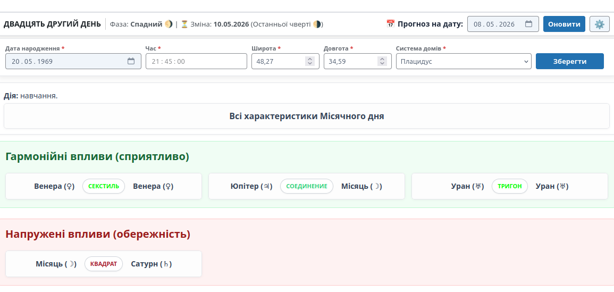

# DAstrolog - Personal Astrology Forecast 🪐


**DAstrolog** — це еталонний Enterprise-плагін для WordPress, який генерує високоточні індивідуальні щоденні астрологічні прогнози. Плагін розраховує транзити поточного дня до натальної карти користувача, використовуючи професійне математичне ядро **швейцарських ефемерід (Swiss Ephemeris - `swetest`)**.

---

## ✨ Особливості (Features)

- 🚀 **Астрономічна точність:** Розрахунки положення планет виконуються через C-бінарник `swetest`, що гарантує точність професійного рівня.
- 📊 **Інтерактивний Дашборд:** Відображення транзитних аспектів у вигляді сучасної сітки карток (Grid), детальна інформація про фази Місяця та Місячні дні.
- ⚡ **Висока продуктивність:** Вбудована система кешування розрахунків (через Transients API) та AJAX-навігація без перезавантаження сторінок.
- 🛠️ **Імпорт баз ZET:** Автоматичний імпорт астрологічних баз даних (тексти транзитів, довідники орбісів/аспектів, описи місячних днів) з конфігураційним файлом `manifest.json`.
- 🛡️ **Enterprise Security:** Строга MVC-архітектура, використання Prepared Statements, UPSERT-запити, Whitelist-санітизація, захист від CSRF (Nonces) та захист форм від спаму (Honeypot).
- 🎨 **UI/UX:** Адаптивний дизайн, "липка" (Sticky) панель навігації датами, інлайн-редагування довідників в адмін-панелі без перезавантаження сторінки.

---

## ⚙️ Системні вимоги

- **PHP:** 8.0 або вище.
- **WordPress:** 6.0 або вище.
- **БД:** MySQL 5.7+ / MariaDB 10.3+.
- **Сервер:** Linux/Unix середовище (Ubuntu, Debian, CentOS тощо) або Docker-контейнер.
- **Функції PHP:** `shell_exec` має бути увімкнена (потрібна для звернення до `swetest`).

---

## 🚀 Встановлення (Installation)

### 1. Підготовка математичного ядра
Плагін використовує зовнішній виконуваний файл `swetest`.
1. Скомпілюйте `swetest` з [офіційного репозиторію Swiss Ephemeris](https://github.com/aloistr/swisseph) для вашої ОС (`make swetest`).
2. Помістіть скомпільований бінарник у директорію плагіна: `DAstrolog/bin/swetest`.
3. Надайте файлу права на виконання:
```bash
chmod +x wp-content/plugins/DAstrolog/bin/swetest
```

4. Помістіть необхідні файли ефемерід (`.se1`) у теку `DAstrolog/ephe/`.

### 2. Встановлення плагіна
1. Завантажте теку `DAstrolog` у директорію `/wp-content/plugins/` вашого сайту.
2. Активуйте плагін через меню "Плагіни" в адмін-панелі WordPress.

---

## 🛠️ Налаштування та Імпорт даних

1. Розмістіть ваші текстові бази даних (кодування UTF-8) у теці `assets/data/` згідно з налаштуваннями у `manifest.json`.
2. Перейдіть до панелі керування: **DAstrolog ➔ Налаштування**.
3. Перевірте блок **"Статус математичного ядра"** — там мають бути дві зелені позначки (✅).
4. По черзі натисніть кнопки імпорту:
   * Імпорт довідників (Аспекти, Орбіси, Доми)
   * Імпорт Інтерпретацій (Транзити)
   * Імпорт Місячних днів

---

## 💻 Використання (Usage)

Для виведення астрологічного щоденника на фронтенді використовуйте шорткод на будь-якій сторінці чи записі:
```php
[DAstrolog]
```
*Примітка: Інтерфейс щоденника буде показано лише авторизованим користувачам.*

---

## 🏗️ Архітектура (Project Structure)

Плагін побудований за модульними стандартами (MVC) для легкого масштабування:
```txt
    DAstrolog/
    ├── DAstrolog.php            # Головний файл (Bootstrap)
    ├── bin/swetest              # Виконуваний файл розрахунків
    ├── ephe/                    # Швейцарські ефемеріди (.se1)
    ├── includes/                
    │   ├── Core/                # Активатор, Деактиватор, Завантажувач
    │   ├── Models/              # Робота з базою даних ($wpdb, CRUD)
    │   ├── Controllers/         # Логіка Адмінки, Фронтенду, AJAX
    │   └── Services/            # Бізнес-логіка (AstroCalculator, EphemerisManager)
    ├── views/                   # HTML-шаблони (Views) без бізнес-логіки
    └── assets/                  # JS, CSS, JSON-маніфест та дані для імпорту
```

---

## 📝 Скріншоти

### Головний дашборд прогнозу


---

## 📄 Ліцензія

Цей проєкт поширюється за ліцензією [MIT](LICENSE). Ви можете вільно використовувати, змінювати та розповсюджувати його.
